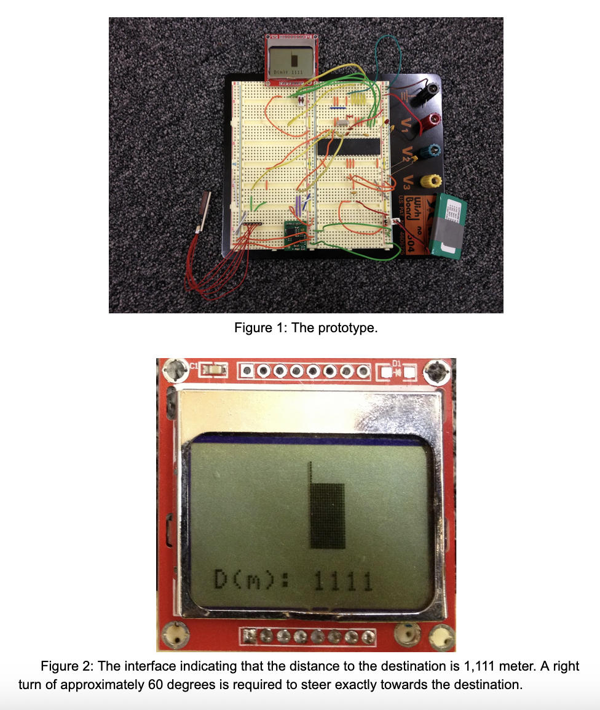

# Digital Compass Project

A program to run on the Atmel164P microprocessor. It used GPS and a compass sensor to determine current location and direction towards a user-defined point of interest. It displayed an arrow on a LCD display pointing towards the point of interest.

The intention was to equip bikers/hikers with a simple interface that would point them in the right direction (as the crow flies) without requiring a complex mapping interface.

The paper I wrote for this project is available [here](digital_compass.pdf).

The datasheet for the Atmel164P microprocessor is available [here](atmel_datasheet.pdf).